<!--
 * @Author: 豆芽(douya.ye@tuya.com)
 * @Date: 2022-03-08 17:36:49
 * @LastEditTime: 2022-03-08 20:31:34
 * @LastEditors: 豆芽(douya.ye@tuya.com)
 * @Description:
 * @FilePath: /yjkzhuzhu.github.io/docs/dev-tool/github自动部署.md
-->

## github Action 自动部署

### 前言

> Github Actions 在 GitHub Actions 的仓库中自动化、自定义和执行软件开发工作流程。 您可以发现、创建和共享操作以执行您喜欢的任何作业（包括 CI/CD），并将操作合并到完全自定义的工作流程中。

简单来说，github actions 是 github 提供的一种免费自动化部署平台，在每个 Git 仓库中都可以看到，如下图，执行 Actions 时，Github 会提供一个服务器进行一些自动化操作，比如提交代码时触发自动编译，然后把编译结果部署到指定的服务器，如果是无须编译的代码，也可以利用 Github 提供的这台服务器通过 SSH 远程控制自己服务器拉取代码，然后在自己服务器执行其他命令操作。

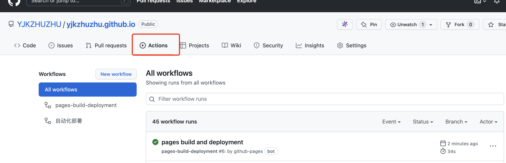

### 主题

- Github-page 部署自己的网站
  1. 无服务端
  2. 纯静态网站
  3. 适用于博客
- github-action 自动部署到服务器

### github-page

#### 准备工作

- 创建[username].github.io 仓库

- 准备好一份静态资源-如 dumi 文档生成工具

- 生成访问令牌-推送代码需要使用到-[链接](https://github.com/settings/tokens)

  1. 创建

  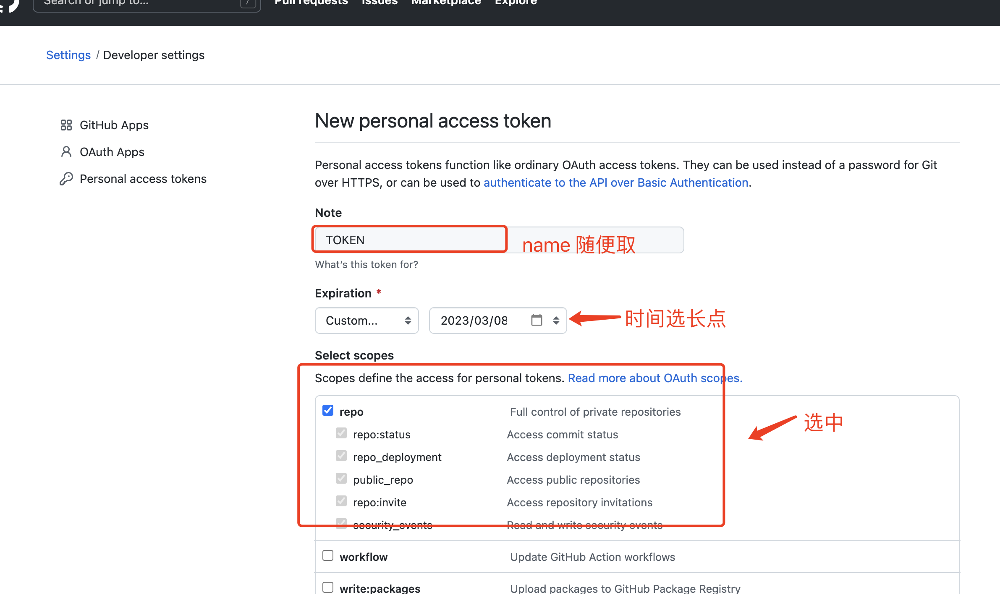

  2. 复制令牌

     

  3. 设置令牌

     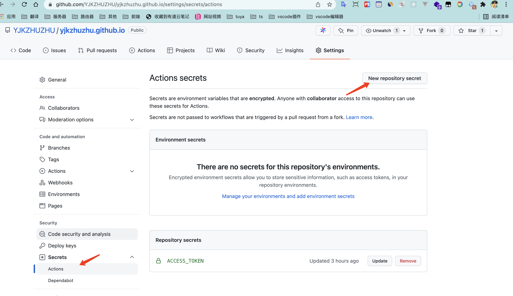

     设置变量-yml 脚本中在推送代码的时候会使用到

     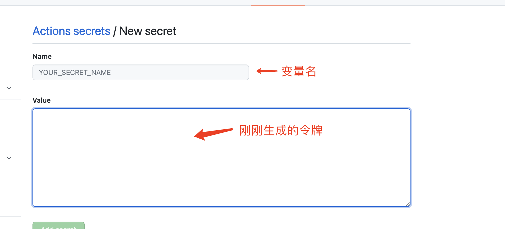

     查看

     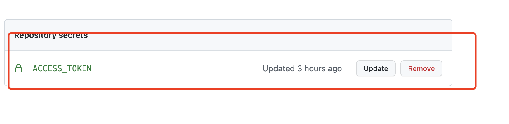

* Action yml 自动化脚本

  新建.github 文件夹-新建\*\*\*.yml 文件

  具体想了解 yml 命令的使用，可参考相关文档

  ```yml
  name: 自动化部署
  on: [push] # 在push代码的时候触发action

  jobs:
    deploy:
      runs-on: ubuntu-latest # 使用那种服务器

      steps:
        - name: 拉取代码
          uses: actions/checkout@v2
        - name: 安装依赖
          run: yarn
        - name: 编译构建
          run: yarn run build

        - name: 部署
          uses: peaceiris/actions-gh-pages@v3 # github-page的插件
          with:
            github_token: ${{ secrets.ACCESS_TOKEN }} # 刚生成的令牌
            publish_dir: ./dist # 将打包的dist文件夹所有的内容推送到gh-pages分支下
  ```

  gh-page 分支下的文件结构

  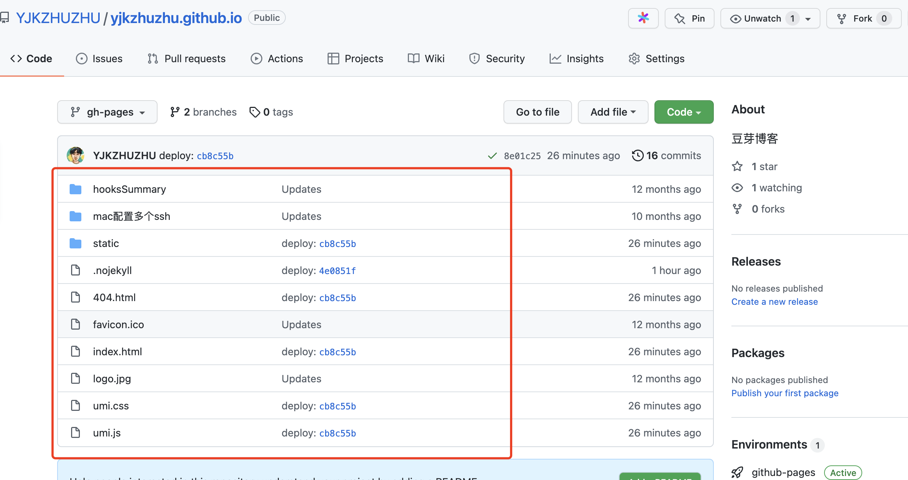

* 配置 github-page

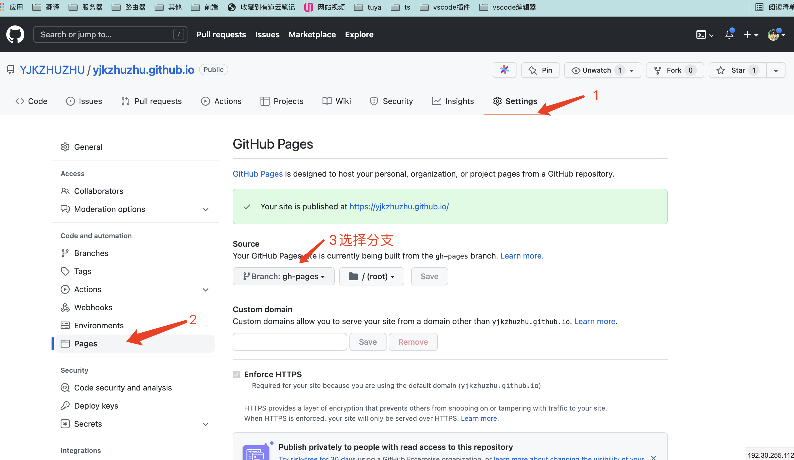

- 等待脚本执行完成-成功后打开-https://yjkzhuzhu.github.io/ 部署需要点时间。等一会就能看到了。

  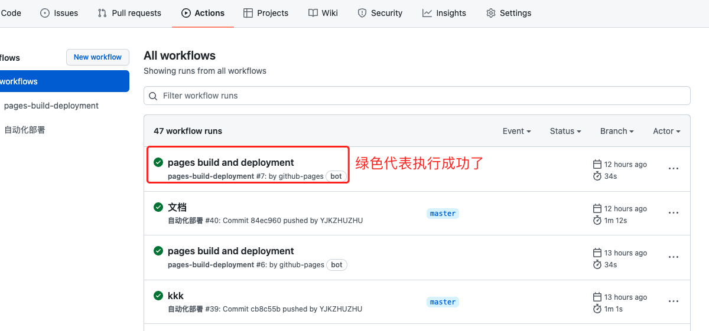

  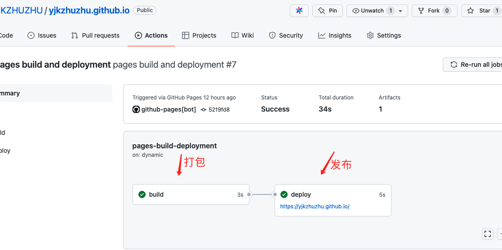

### github-action 自动部署到服务器-进阶

#### 所需准备

- 一台服务器

- 在服务器生成秘钥和公钥-服务器连接最好使用私钥个公钥连接-安全和免登陆

  注意：ssh-keygen -t rsa -C xxxxxx@xxx 正常的生成 git 秘钥和公钥的命令，但是在服务器中需要把-C 去掉（PS:折腾了好久，最后还是请教了搞运维的同学，专业的人还是干专业的事哈哈）

- 仓库添加服务器配置

  ​ 需要在对应的仓库添加如下配置-目的是为了隐藏一些敏感信息，通过变量的形式，在 yml 配置文件中使用

  ​ 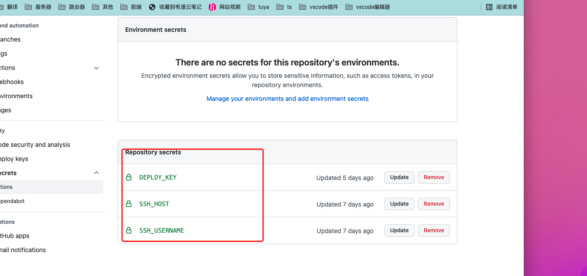

  - host: 主机域名或 ip 地址-创建一个变量名字为 SSH_HOST，填写你的服务器 IP 或者域名，比如 8.129.175.169

  - key:创建一个变量命名为 DEPLOY_KEY，填写你的服务器 ssh 私钥

    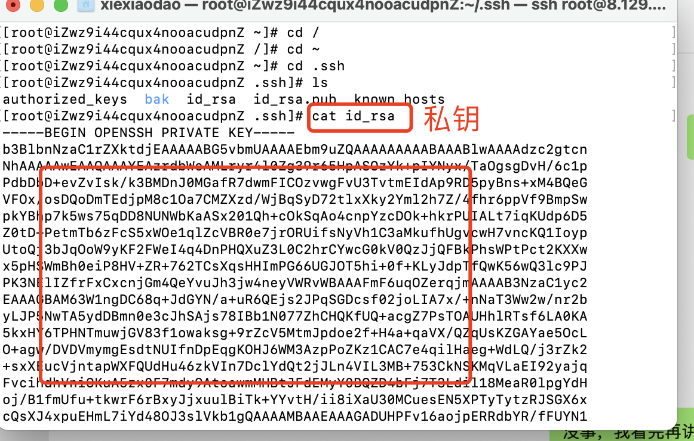

  - username:创建一个变量命名为 SSH_USERNAME，填写连接服务器的用户名, 如 root

- 新增配置文件 yml

  ```yaml
  name: 自动部署 #action名称
  on: [push]

  jobs:
    deploy:
      runs-on: ubuntu-latest # 指定用什么版本服务器来执行

      steps:
        - name: 拉取代码
          uses: actions/checkout@v2

        - name: 指定node版本
          uses: actions/setup-node@v1
          with:
            node-version: '14.16.0'

        - name: 将npm配置为使用 https
          run: >
            git config --global url."https://github.com/".insteadOf
            ssh://git@github.com/

        - name: 安装依赖
          run: npm i

        - name: 编译构建
          run: npm run build

        - name: 删除服务器文件
          uses: appleboy/ssh-action@master
          with:
            # 这里配置对应仓库设置的变量，就可以避免服务器配置暴露
            host: ${{ secrets.SSH_HOST }}
            username: ${{ secrets.SSH_USERNAME }}
            key: ${{ secrets.DEPLOY_KEY }}

            # 先用 SSH 命令删除旧文件
            script: |
              echo "======= 开始删除 ========="
              rm -rf /usr/local/nginx/html/*
              echo "======= 新建文件删除文件夹iconfont static ========="
              mkdir  /usr/local/nginx/html/iconfont
              mkdir  /usr/local/nginx/html/static
              echo "======= 新建文件完成 ========="

        - name: 打包文件推送到服务器
          uses: wlixcc/SFTP-Deploy-Action@v1.0 # 这个是sftp插件
          with:
            server: ${{ secrets.SSH_HOST }} ## 刚才配置的SSH_HOST
            username: ${{ secrets.SSH_USERNAME }}
            ssh_private_key: ${{ secrets.DEPLOY_KEY }}
            local_path: './dist/*'
            remote_path: '/usr/local/nginx/html'
  ```

  到此就配置完成了，等待执行就好了。-如果部署的网站涉及到后台，在自己服务器上的 nginx 上转发一下就好了，再次不做介绍
