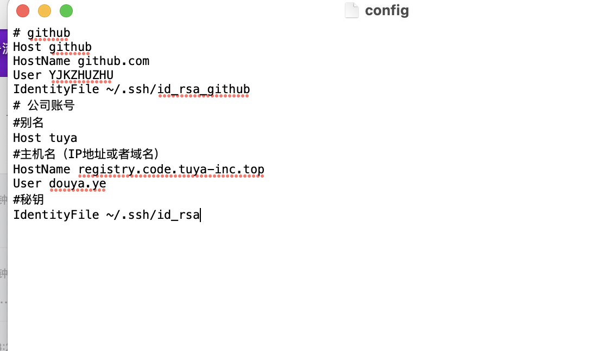
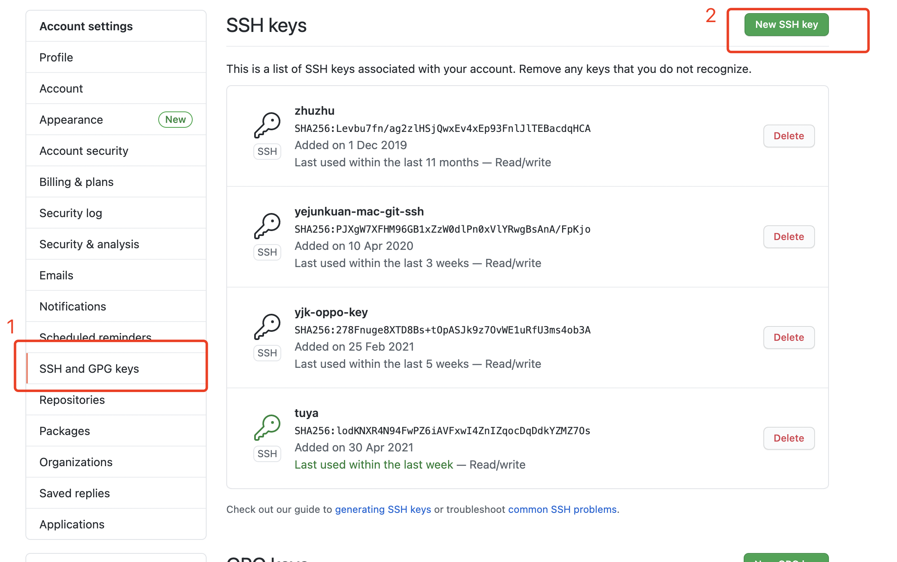
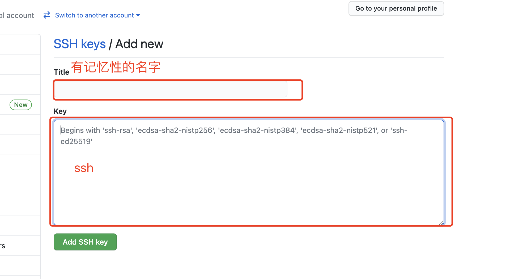

## mac 配置多个 ssh

> 既要使用公司的 git 仓库，还要用自己的 github 的仓库，这时候配置多个 ssh 是非常有必要的。

### 生成`ssh key` 命令行

```shell
// 生成自定义秘钥名
ssh-keygen -t rsa -C "youremail@email.com" -f ~/.ssh/github_xxx_rsa
// 默认秘钥名
ssh-keygen -t rsa -C "youremail@email.com"
```


### 配置`config`文件

> 在`.ssh`文件夹下打开`config`文件，没有就当前目录新建一个`touch config`,`.ssh`是隐藏文件夹，若要显示隐藏文件或者文件夹，快捷键`command+shift+.`



### 将对应公钥添加到对应仓库中去





### 测试配置文件是否正常工作
