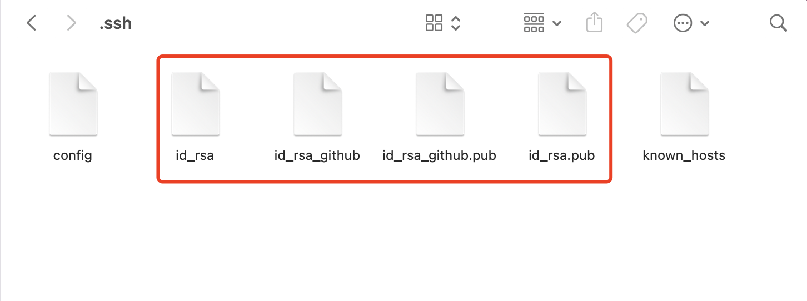

## mac 配置多个 ssh

> 既要使用公司的 git 仓库，还要用自己的 github 的仓库，这时候配置多个 ssh 是非常有必要的。

### 生成`ssh key` 命令行

```shell
// 生成自定义秘钥名
ssh-keygen -t rsa -C "youremail@email.com" -f ~/.ssh/github_xxx_rsa
// 默认秘钥名
ssh-keygen -t rsa -C "youremail@email.com"
```



### 配置`config`文件

> 在`.ssh`文件夹下打开`config`文件，没有就当前目录新建一个`touch config`,`.ssh`是隐藏文件夹，若要显示隐藏文件或者文件夹，快捷键`command+shift+.`


### 将对应公钥添加到对应仓库中去


### 测试配置文件是否正常工作

```shell
ssh -T git@github.com
```

出现`Hi YJKZHUZHU! You've successfully authenticated, but GitHub does not provide shell access.`则说明配置成功哦

如果出现如下提示，则说明有权限问题：

`Permission denied (publickey)`

如果有权限问题的情况下，你对项目执行 push 操作的时候，会得到如下提示：

```shell
Warning: Permanently added the RSA host key for IP address '192.30.252.129' to the list of known hosts.
Permission denied (publickey).
fatal: Could not read from remote repository.

Please make sure you have the correct access rights
and the repository exists.
```

多用户时出现权限问题的原因：

> github 使用 SSH 与客户端连接。如果是单用户（first），生成密钥对后，将公钥保存至 [GitHub](https://github.com/YJKZHUZHU/yjkzhuzhu.github.io) ，每次连接时 SSH 客户端发送本地私钥（默认~/.ssh/id_rsa）到服务端验证。单用户情况下，连接的服务器上保存的公钥和发送的私钥自然是配对的。但是如果是 **多用户** （first，second），我们在连接到 second 的帐号时，second 保存的是自己的公钥，但是 SSH 客户端依然发送默认私钥，即 first 的私钥，那么这个验证自然无法通过。

解决 ssh 权限问题:

> 通常一台电脑生成一个 ssh 不会有这个问题，当一台电脑生成多个 ssh 的时候，就可能遇到这个问题，解决步骤如下

- 查看系统 ssh-key 代理,执行如下命令

  `ssh-add -l`

  

  以上命令如果输出`The agent has no identities.`则表示没有代理。如果系统有代理，可以执行下面的命令清除代理:

  `ssh-add -D`

- 然后依次将不同的 ssh 添加代理，执行命令如下：

  `ssh-add ~/.ssh/id_rsa`

  `ssh-add ~/.ssh/id_rsa_github`

  如果使用 `ssh-add ~/.ssh/id_rsa`的时候报如下错误，则需要先运行一下 `ssh-agent bash` 命令后再执行 `ssh-add` ...等命令

  `Could not open a connection to your authentication agent.`
