## React Native 解析

### React Native 基本概念

#### JavascriptCore(JSC)

要保证 RN 代码运行，首先要有一套 js 代码的运行环境，这套运行环境就是 JavascriptCore，但在 chrome 中进行调试的时候，由于 JS 代码都是在 chrome 的 V8 引擎中执行的，导致部分代码在 debug 模式下和非 debug 模式下存在差异。

比如：

1.  ios 中部分日期函数未实现，比如在 IOS 中无法将 2021-08-26 日期转换成 Date 对象，而是需要将"-"替换为"/"再做转换，但在 chrome 中调试时却不会有这个问题。
2.  安卓在 debug 情况下，若有非法空白字符未处于 Text 标签下时，并不会报错，但在非 debug 环境下却会报红屏。因此开发时需要了解这些差异，避免出现此类情况。
3.  关于 JavascriptCore 的详细介绍，可参照[官方文档](https://trac.webkit.org/wiki/JavaScriptCore)，里面详细介绍了 JSC 的组成部分及各部分的作用。

#### JSI(Javascript Interface)

​ JSI 是一个轻量级 c++库，通过 jsi，可以实现 js 直接对 c++层对象及方法进行调用。它是一个可运行于多种 js 引擎的中间适配层，有了 jsi，使得 RN 框架不仅可以基于 JSC 运行，还可以使用 V8 或 hermes 引擎。jsi 是 2018 年 facebook 对 RN 框架进行重构时引入的，引入后 RN 的架构也发生了较大的变化，性能得到了较大的提升。

#### jsbundle

有了 JS 运行时，还需要将可执行的代码加载到 App 中，jsbundle 就是我们需要的 JS 代码。

业务开发完成后， 我们会通过 react-native-cli 提供的打包命令进行打包，打包脚本会将我们开发的代码进行压编码，生成压缩后的 bundle 包， 如我们每个面板程序中打包后都会有一个 main.bundle 的 js 包， 而 js 中依赖的资源会根据相应的路径复制到对应的文件夹中。

#### 环境变量及方法定义

jsbundle 的第一行定义了运行时环境变量，用于表明所运行的 node 环境处于生产环境， 以及记录脚本启动的时间。

```javascript
var __DEV__ = false,
  __BUNDLE_START_TIME__ = this.nativePerformanceNow
    ? nativePerformanceNow()
    : Date.now(),
  process = this.process || {};
process.env = process.env || {};
process.env.NODE_ENV = 'production';
```

第二到 10 行定义了全局方法，如**d、**c、\_\_r、setGlobalHandler、reportFatalError 等方法， 为 RN 环境启动的基本方法。

#### ReactNative 框架及业务代码定义

在第 11 行开始进入 React Native 框架、第三方库以及个人代码定义部分，该部分通过第二行定义的\_\_d 方法，对代码中的方法及变量进行定义。

\_\_d 方法接受 3 个参数：

第一个参数表示该模块（一般为一个文件中通过 export default 导出的部分）的定义。即我们或第三方开发人员写的某个代码文件中的代码逻辑。

第二个参数表示该模块的 moduleId，在其他模块对该模块进行引用时，需要通过该 id 来引用。 该值可以为数字，也可以为字符串，但要保证每个模块的 id 都是唯一的。 打包系统默认按照数字的递增的形式来定义该 id。

第三个参数表示该模块对其他模块的依赖，是一个数组，数组中的每个数字表示一个依赖的模块。

```javascript
__d(
  function(g, r, i, a, m, e, d) {
    var t = r(d[0]),
      n = t(r(d[1]));
    t(r(d[2]));
    r(d[3]);
    var l = r(d[4]),
      o = t(r(d[5])),
      s = r(d[6]),
      u = t(r(d[7])),
      p = t(r(d[8]));
    for (var f in ((l.TextInput.defaultProps = (0, n.default)(
      {},
      l.TextInput.defaultProps,
      { allowFontScaling: !1 },
    )),
    (l.Text.defaultProps = (0, n.default)({}, l.Text.defaultProps, {
      allowFontScaling: !1,
    })),
    (console.disableYellowBox = !0),
    l.UIManager))
      l.UIManager.hasOwnProperty(f) &&
        l.UIManager[f] &&
        l.UIManager[f].directEventTypes &&
        ((l.UIManager[f].directEventTypes.onGestureHandlerEvent = {
          registrationName: 'onGestureHandlerEvent',
        }),
        (l.UIManager[f].directEventTypes.onGestureHandlerStateChange = {
          registrationName: 'onGestureHandlerStateChange',
        }));
    r(d[9]),
      r(d[10]),
      r(d[11]),
      (g.userStore = (0, s.createStore)(
        u.default,
        (0, s.applyMiddleware)(p.default),
      )),
      o.default.hide();
  },
  0,
  [1, 2, 3, 6, 18, 416, 417, 420, 422, 423, 656, 727],
);
__d(
  function(g, r, i, a, m, e, d) {
    m.exports = function(n) {
      return n && n.__esModule ? n : { default: n };
    };
  },
  1,
  [],
);
__d(
  function(g, r, i, a, m, e, d) {
    function t() {
      return (
        (m.exports = t =
          Object.assign ||
          function(t) {
            for (var n = 1; n < arguments.length; n++) {
              var o = arguments[n];
              for (var p in o)
                Object.prototype.hasOwnProperty.call(o, p) && (t[p] = o[p]);
            }
            return t;
          }),
        t.apply(this, arguments)
      );
    }
    m.exports = t;
  },
  2,
  [],
);
__d(
  function(g, r, i, a, m, e, d) {
    'use strict';
    m.exports = r(d[0]);
  },
  3,
  [4],
);
```

#### 引用与启动入口

只有定义了，还不足以使我们的 RN 应用运行起来， 如果要运行，还需要将我们的入口模块引用起来，于是此处就使用到了\_\_r 的方法。

\_\_r 方法接受一个参数，该参数为要引用的模块 id，若该模块没有被初始化，则尝试加载并初始化该模块，若未找到该模块，则会抛出 "Requiring unkonwn module ‘xxx’"的错误。

```javascript
__r(104);
__r(0);
```

#### RCTBridge/ReactBridge

JS 代码和 JS 运行时都准备好了，如何才能将这些代码运行起来呢？

做过或了解过 RN 开发的同学都知道，在 RN 开发中有一个 Bridge 的概念十分重要， 它在 js 端与原生端起到桥接的作用，是 js 与原生通讯和交互的基础，在整个 RN 生命周期中，它主要承担了如下工作。

1.  创建 RN 运行时
2.  执行 js 代码，将 jsbundle 加载并执行
3.  维护 js 与原生的双端通讯
4.  维护导出方法表及映射关系

#### RCTRootView/RCTShadowView

JS 代码、运行时、JS 执行对象都准备好了，我们还需要一个视图容器将 React 里画的界面渲染出来。

此时就需要 RCTRootView 出场了，RCTRootView 作为 RN 的根容器，起到承载所有子视图的功能，但 React 的界面并非直接加载到 RCTRootView 上的， 它还有一层子视图 RCTRootContentView，它才是直接承载视图的对象。

那 RCTShadowView 又是什么呢？ RCTShadowView 是对 RCT 视图树的镜像，类似于 React 中的虚拟 Dom，负责维护每个视图实例的状态，js 端发生变更时，首先由 RCTShadowView 收集并计算变化值，数据处理完成后，再将值同步给其对应的视图进行更新。

#### RCTUIManager

视图容器也有了，那界面里这么多视图，这么多组件的实例，由谁来管理呢？

UIManager 承担了管理原生视图以及传递实图事件的责任，由原生端导致的视图实例都由 UIManager 进行管理，在创建视图时为每个视图实例添加唯一的 tag 作为 key 值，这样在 js 端需要操作视图时，只需要将 tag 和参数传递给 UIManager，就可以定位到具体的视图实例。

#### RCTBridgeModule

​ js 端和原生端如何进行通讯呢，我们又该如何去定义自己的方法让 js 进行调用呢？RN 框架提供了一个协议 RCTBridgeModule，实现这个协议就可以实现两端的通讯。

​ RCTBridge 和 RCTUIManager 都实现了 RCTBridgeModule 协议，RN 环境启动时会扫描所有实现该协议的类，生成一张表格，原生端和 JS 端都会保存这一张表格，它是一张映射表，有了这张映射表就可以让两端在调用方法时能够精准地找到对应的实现。

#### MessageQueue

有了通讯的桥梁还不足以支撑异步操作，若全部通讯及 UI 渲染都通过同步执行，那性能将会有很大的瓶颈。因此需要引入 MessageQueue 来作为通讯的池子，所有的通讯与交互事件都抛入池中，再通过规则去对池子进行读取刷新。MessageQueue 就主要承担起异步事件交互通知的任务。这也是为什么调用原生方法时，原生端并不会立即生效的原因，比如锁定横屏操作时，在调用旋转为横屏的方法后，需要做一个延迟操作再将旋转锁定。

```javascript
RCTOrientationManager.lockOrientation('landscape-left');
setTimeout(() => {
  RCTOrientationManager.shouldAutorotate(false);
}, 200);
```

### React Native 运行原理

​ React Native 主要分为两部分： 一是 React，即 JSX 层实现的视图及业务逻辑。二是 Native，即原生端拿 js 层实现的逻辑进行的界面渲染。而这两部分之所以能够实现互通，依赖的是 jsc（javascriptCore）,jsc 能够执行 js 代码，并通过解析将 js 代码中实现的视图映射为对应的原生组件， 按需执行 js 逻辑代码。正是由于 jsc 的存在，才使得我们可以通过 js 代码来写原生应用。 但仅靠 jsc 也无法正常运行起一个 RN 的应用，其中还依赖了一些其他实现。

#### RN 整体架构

在 jsi 小节我们提到了 RN 的架构因 jsi 的引入发生了较大的变化。

#### 现版本架构

我们可以按逻辑所在线程来分为 JS 线程、UI 线程（主线程）、Shadow 线程三部分。其中 Shadow 线程主要负责上面提到的 ShadowView 更新的计算，这部分操作由 c++层的 yoga 框架完成， 计算完成后再将数据交由主线程进行真实视图的刷新。

​ 当 React（js 层）需要更新界面或调用原生端接口时，需要通过 bridge 将调用参数转换成 JSON 字符串，将 json 数据通过 bridge 传递到原生层，原生层通过解析 json 数据，找到对应的方法或视图执行操作，无法实现 js 层与原生层直接调用，同时在数据通讯时三个线程中的数据无法共享，只能各自保存一份，各自维护，三个线程中的通讯也只能通过异步调用。

​ 其中 NativeModules 需要在启动的时候全部加载，并在原生端和 js 端务维护一个对象来保证在 js 端调用时能够正确地找到对应的方法，这部分操作在启动过程会占用较多的资源，且会加载大量使用不到的资源。

​ 目前我们使用的 0.59.10 版本的 RN 框架，虽然已经引入的 jsi 架构，但实际上并没有在通讯中使用到，通讯依然是通过 bridge 实现的。

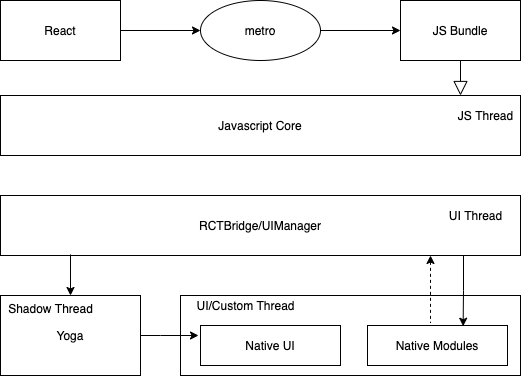

#### 新版本架构

对比现版本架构，新版本引入了 jsi 和 fabric 的概念，jsi 实现了 js 层和原生层的相互调用，fabric 将替代 UIManager，包含了 renderer 和 shadow thread，而引入 jsi 之后，实现了多个线程之前的数据共享，不再需要使用 json 格式的数据相互传递，并保留副本。

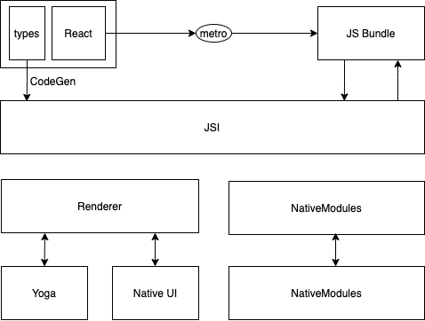

新版本的架构并依然使用三个线程进行并行处理，但三条线程都可以访问 js 线程中的数据，NativeModules 引入了 TurboModules 技术也，再是在启动时全部加载，而是在使用时按需加载。同时新架构还引入了 CodeGen 的技术，能够根据 types 的定义，自动生成 TurboModules 原生代码，自动兼容线程之间的相互通讯。

新版本架构目前还未发布，但已在 facebook 内部应用中进行了迭代使用，预计下半年会有大版本更新发布。参照：https://reactnative.dev/blog/2021/08/19/h2-2021

#### RN 启动逻辑

了解了 RN 的基本架构，我们还需要了解一下当前架构的 RN 架构的启动流程是怎样的。其整体逻辑可简化为如下流程：

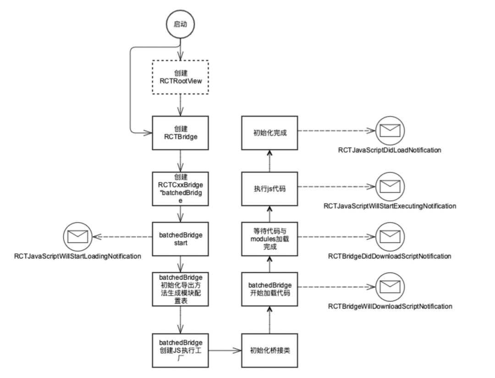

#### 创建 RCTRootView

​ 上面提到 RCTRootView 是 RN 界面的原生容器，一般对于未拆包的 RN 应用来说， 在 App 启动时即可创建出 RCTRootView 作为 App 的根视图。我们一般使用-(instancetype)initWithBundleURL:moduleName:initialProperties:launchOptions:方法来创建 RCTRootView。传入四个参数分别是 jsbundle 的路径 url；要启动的应用的名称（JS 中通过 AppRegistry.registerComponent 注册的根组件名称）；初始化参数（会作为启动参数传入根组件的 props）；App 启动参数（一般不需要关心）；使用该方法创建 RCTRootView 时会同时创建出 RCTBridge 来维护整个 RN 应用的生命周期。

```javascript
   [[RCTRootView alloc] initWithBundleURL:[NSURL fileURLWithPath:panelPath] moduleName:@"Demo" initialProperties:initialProps launchOptions:launchOptions];
```

#### 创建 RCTBridge

RCTBridge 是维护 RN 生命周期的重要对象，我们也可以在 RCTBridge 对你中提取需要的参数，需要的方法等。因此我们一般会更多地采用先创建一个 RCTBridge 再通过 RCTBridge 来创建 RCTRootView 的形式来初始化 RN 应用。

```objective-c
  RCTBridge *bridge = [[RCTBridge alloc] initWithDelegate:self launchOptions:launchOptions];
//或
  RCTBridge *bridge = [[RCTBridge alloc] initWithBundleURL:[[NSBundle mainBundle]	URLForResource:@"main" withExtension:@"jsbundle"] moduleProvider:nil 	launchOptions:launchOptions];
  RCTRootView *rootView = [[RCTRootView alloc] initWithBridge:bridge
                                                   moduleName:@"Demo"

                                            initialProperties:nil];
- (NSURL *)sourceURLForBridge:(RCTBridge *)bridge
{
#if DEBUG
  return [[RCTBundleURLProvider sharedSettings] jsBundleURLForBundleRoot:@"index" fallbackResource:nil];
#else
  return [[NSBundle mainBundle] URLForResource:@"main" withExtension:@"jsbundle"];
#endif
}
```

其中 moduleProvider 可以去配置该 bridge 可以访问到哪些 NativeModules，在拆包应用控制权限时可以用到。

#### RCTCxxBridge

RCTBridge 初始化时会将创建时设置的 bundleUrl 保存，并创建一个 RCTCxxBridge 的实例 batchedBridge 去初始化 RN 的环境。

```objective-c
  self.batchedBridge = [[bridgeClass alloc] initWithParentBridge:self];
  [self.batchedBridge start];
```

#### 加载 RCTBridgeModule

batchedBridge 启动首先发送将要加载的通知，之后创建 js 线程进行线程初始化，随后注册 NativeModules。

```objective-c
 RCT_PROFILE_BEGIN_EVENT(RCTProfileTagAlways, @"-[RCTCxxBridge start]", nil);


  [[NSNotificationCenter defaultCenter] postNotificationName:RCTJavaScriptWillStartLoadingNotification
                                                      object:_parentBridge
                                                    userInfo:@{@"bridge" : self}];


  // Set up the JS thread early
  _jsThread = [[NSThread alloc] initWithTarget:[self class] selector:@selector(runRunLoop) object:nil];
  _jsThread.name = RCTJSThreadName;
  _jsThread.qualityOfService = NSOperationQualityOfServiceUserInteractive;
#if RCT_DEBUG
  _jsThread.stackSize *= 2;
#endif
  [_jsThread start];
...


  [self registerExtraModules];
  // Initialize all native modules that cannot be loaded lazily
  (void)[self _initializeModules:RCTGetModuleClasses() withDispatchGroup:prepareBridge lazilyDiscovered:NO];
  [self registerExtraLazyModules];

...
  dispatch_group_enter(prepareBridge);
  [self ensureOnJavaScriptThread:^{
    [weakSelf _initializeBridge:executorFactory];
    dispatch_group_leave(prepareBridge);
  }];
```

#### 执行 JS 代码

NativeModules 加载完成之后开始读取 jsbundle 代码到内存中，读取完成后执行 js 代码。

```objective-c
  dispatch_group_enter(prepareBridge);
  __block NSData *sourceCode;
  [self
      loadSource:^(NSError *error, RCTSource *source) {
        if (error) {
          [weakSelf handleError:error];
        }


        sourceCode = source.data;
        dispatch_group_leave(prepareBridge);
      }
      onProgress:^(RCTLoadingProgress *progressData) {
#if (RCT_DEV | RCT_ENABLE_LOADING_VIEW) && __has_include(<React/RCTDevLoadingViewProtocol.h>)
        id<RCTDevLoadingViewProtocol> loadingView = [weakSelf moduleForName:@"DevLoadingView"
                                                      lazilyLoadIfNecessary:YES];
        [loadingView updateProgress:progressData];
#endif
      }];


  // Wait for both the modules and source code to have finished loading
  dispatch_group_notify(prepareBridge, dispatch_get_global_queue(QOS_CLASS_USER_INTERACTIVE, 0), ^{
    RCTCxxBridge *strongSelf = weakSelf;
    if (sourceCode && strongSelf.loading) {
      [strongSelf executeSourceCode:sourceCode sync:NO];
    }
  });
```

此时 js 代码已经执行到了内存中，根组件也已经注册，发送加载完毕的通知，此时 RCTRootView 可以创建 RCTRootContentView 了。

#### runApplication

RCTRootView 创建完成 RCTRootContentView 后立即调用 AppRegistry.runApplication 方法，开始加载 RN 逻辑进行渲染。此时开始走 RN 的逻辑流程。

```objective-c
  _contentView = [[RCTRootContentView alloc] initWithFrame:self.bounds
                                                    bridge:bridge
                                                  reactTag:self.reactTag
                                            sizeFlexiblity:_sizeFlexibility];
  [self runApplication:bridge];


- (void)runApplication:(RCTBridge *)bridge
{
  NSString *moduleName = _moduleName ?: @"";
  NSDictionary *appParameters = @{
    @"rootTag" : _contentView.reactTag,
    @"initialProps" : _appProperties ?: @{},
  };


  RCTLogInfo(@"Running application %@ (%@)", moduleName, appParameters);
  [bridge enqueueJSCall:@"AppRegistry" method:@"runApplication" args:@[ moduleName, appParameters ] completion:NULL];
}
```

#### 界面渲染上屏

RCTRootView 调用 runApplicaton 之后，该方法调用会通过 jscore 以消息的形式将业务启动参数发送到 js 端的 messageQueue(batchedBridge)中（上面提到过 messageQueue 是被动接收数据，主动定时刷新的形式。默认情况下 messageQueue 每 5ms 会进行一次 flush 操作，flush 时发现新的消息会按照消息的参数进行逻辑的执行。），当执行到 runApplication 时会使用通过 AppRegistry.registerComponent 注册的组件进行界面的加载。 此时会通过 UIManager 根据 Dom 树中的组件及层级创建出 dom 配置，通过 json 的形式传递给原生端 RCTUIManager， RCTUIManager 再根据配置去创建或刷新 Shadow，通过 yoga 计算出各组件的渲染参数（宽度、高度、位置等），将计算好的配置传递给对应的原生视图，如 RCTView、RCTImage 等组件，这些组件就会被按层级渲染到 RCTRootContentView 上，完成首屏的渲染。

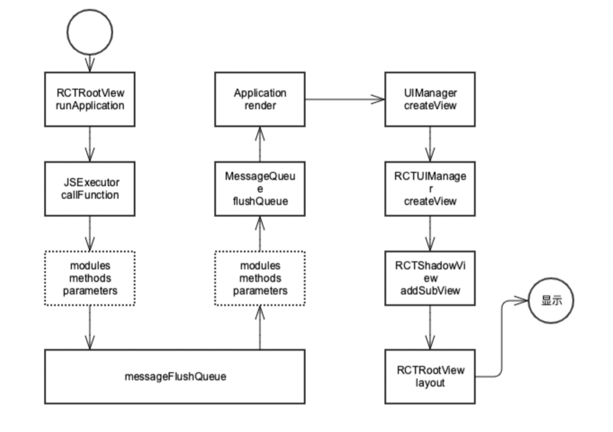

#### JSX 与原生视图映射逻辑

上面提到 js 端 uimanager 需要将每个组件的配置传递给原生端的 UIManager，UIManager 再处理后续的渲染过程，那么两端的 UIManager 是如何统一配置的呢？

在 1.6、1.7 节中我们提到 RCTUIManager 遵循 RCTBridgeModule 协议，该协议允许注册模块及模块方法。2.2.4 中又提到在 RCTBridge 初始化过程中，会去注册导出模块及方法，注册完成后 js 端即可拿到这些模块的方法的引用。

在模块注册时，其实是会在原生端和 js 端同时生成一份配置文件，remoteModuleConfig，在 js 端可以通过

\_\_fbBatchedBridgeConfig 查看该变量。

​ js 端在调用方法时，会根据这份配置文件，定位到原生端对应的组件进行相应的事件或配置的传递。

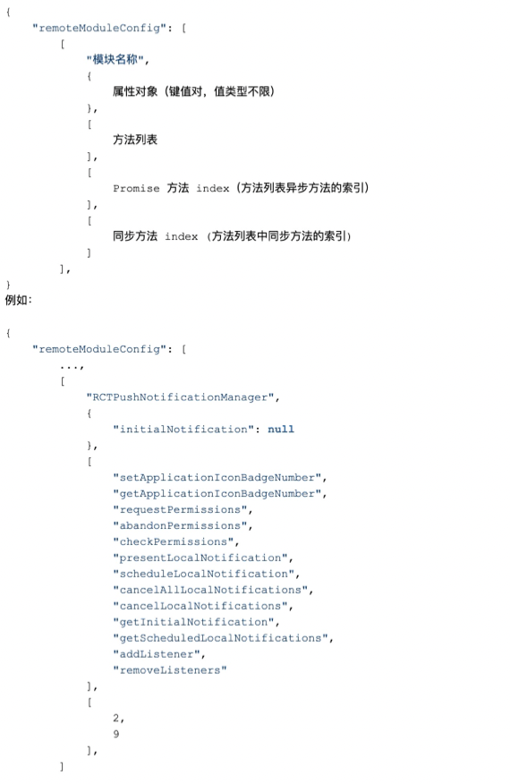

#### JS 与原生通讯逻辑

1. JS 调用原生事件

   JS 可以通过导出模块或组件中的方法来触发原生端方法，这里使用触发是因为该操作是异步的，无法直接拿到原生端的返回值，只能通过回调或 Promise 的形式来处理返回值。此处也依赖了 2.3 中提到的模块注册时导出的配置文件。

   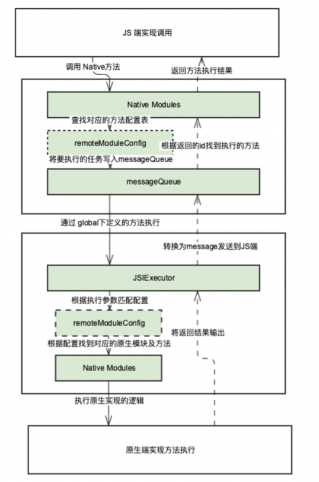\

   2. 事件通知

      事件通过机制就比较简单，而且双端都支持发送通知和注册监听，我们可以通过 NativeAppEventEmitter, DeviceEventEmitter, NativeEventEmitter 来注册和发送通知。

   ### React Native 打包与拆包

   #### 打包

   react-native-cli 提供了打包命令，我们可以配合 metro.config.js 来配置打包参数。

   安装 react-native-cli 之后，在 rn 项目根目录下执行 react-native bundle -h 得到如下帮助信息。

   ```shell
   Options:
     --entry-file <path>                Path to the root JS file, either absolute or relative to JS root
     --platform [string]                Either "ios" or "android" (default: "ios")
     --transformer [string]             Specify a custom transformer to be used
     --dev [boolean]                    If false, warnings are disabled and the bundle is minified (default: true)
     --minify [boolean]                 Allows overriding whether bundle is minified. This defaults to false if dev is true, and true if dev is false. Disabling minification can be useful for speeding up production builds for testing purposes.
     --bundle-output <string>           File name where to store the resulting bundle, ex. /tmp/groups.bundle
     --bundle-encoding [string]         Encoding the bundle should be written in (https://nodejs.org/api/buffer.html#buffer_buffer). (default: "utf8")
     --max-workers [number]             Specifies the maximum number of workers the worker-pool will spawn for transforming files. This defaults to the number of the cores available on your machine.
     --sourcemap-output [string]        File name where to store the sourcemap file for resulting bundle, ex. /tmp/groups.map
     --sourcemap-sources-root [string]  Path to make sourcemap's sources entries relative to, ex. /root/dir
     --sourcemap-use-absolute-path      Report SourceMapURL using its full path
     --assets-dest [string]             Directory name where to store assets referenced in the bundle
     --reset-cache                      Removes cached files
     --read-global-cache                Try to fetch transformed JS code from the global cache, if configured.
     --config [string]                  Path to the CLI configuration file
   ```

   我们在打包时需要用到的几个参数有：

   --entry-file：入口文件，一般使用根目录下的 index.js 作为入口文件即可。

   --platform: 打包的平台，ios 或 android。

   --dev: 是否为 debug 模式，默认是 debug 模式，因此需要将其设置为 false。

   --minify: 是否压缩代码，当 dev 是 true 的时候，minify 默认为 false。 反之当 dev 为 false 的时候 minify 默认为 true。

   --bundle-output: 打包后的 jsbundle 存储路径。

   --assets-dest: 打包后资源存储路径，该路径会生成 jsbundle 中资源文件引用的相对路径，配置时需注意，尽量和 jsbundle 在同级目录下。

   --sourcemap-output: 输出 sourcemap 的路径，不添加不会输出 sourcemap。

   --config: matroconfig 配置文件位置，用来配置打包信息，可以做一些拆包配置。

   #### 拆包

   默认情况下， 我们直接通过如下命令就可以打出一个完整的 RN 包。

   ```shell
   react-native bundle --entry-file ./index.js --platform ios --dev false --bundle-output ./build/ios/main.jsbundle --assets-dest ./build/ios/assets
   ```

   但对于一个大型的项目，很多业务都是按照产品线或其他场景来划分的业务组来做的， 并不适合整个应用打出一个完整的包。我们可以采用类似于涂鸦智能这种，每个面板创建一个 RCTRootView 并由一个单独的 RCTBridge 维护的形式，优点就是不需要拆包，每个面板业务环境独立，不存在变量污染的情况。缺点就是，每个业务包都很大，下载比较消耗资源，每个面板都创建一套独立的 js 运行环境，不适合过多面板同时运行。

   我们也可以采用拆包加载的形式，将每个面板业务拆分为三个部分。

   1 RN 框架部分，此部分为 RN 框架最核心的代码，需要在面板启动前加载完成保证后续的加载逻辑正常。此部分一般不会有变更，可以跟着 App 版本进行发布迭代。

   2 公共库部分，比如一些第三方依赖，tuya-panel-kit 等。此部分可以单独发布热更新版本，用于修复公共库中的 bug。

   3 业务部分，此部分为业务代码，需要根据业务需求进行变更，同时也可能添加一些非公共的第三方库依赖。

   为了简单一些，我们将 1 和 2 合并为一个模块，在此我们称其为基础包。 3 作为业务部分称为业务包。

   首先我们为基础包生成一个配置文件，指定哪些文件需要打包进基础包，以及打包过程中每个模块的 id 如何定义。

   ```javascript
   const pathSep = require('path').sep;
   function createModuleIdFactory() {
     // 获取每个模块的id如何定义
     const projectRootPath = __dirname; //获取命令行执行的目录，__dirname是nodejs提供的变量
     return path => {
       let name = '';
       if (
         path.indexOf(
           'node_modules' +
             pathSep +
             'react-native' +
             pathSep +
             'Libraries' +
             pathSep,
         ) > 0
       ) {
         name = path.substr(path.lastIndexOf(pathSep) + 1); //这里是去除路径中的'node_modules/react-native/Libraries/‘之前（包括）的字符串，可以减少包大小，可有可无
       } else if (path.indexOf(projectRootPath) == 0) {
         name = path.substr(projectRootPath.length + 1); //这里是取相对路径，不这么弄的话就会打出_user_smallnew_works_....这么长的路径，还会把计算机名打进去
       }
       return name; // 这里我们使用文件的相对路径作为每个模块的moduleId
     };
   }
   function processModuleFilter(module) {
     // 过滤该module是否需要打包
     if (
       module.path.indexOf('node_modules') > -1 // node_modules下被引用到的文件需要打包
     ) {
       return true;
     }
     return false;
   }
   function getRunModuleStatement(entryFilePath) {
     return `__r('indexCore$js')`; // 配置最后需要require执行的入口文件
   }
   module.exports = {
     transformer: {
       getTransformOptions: async () => ({
         transform: {
           experimentalImportSupport: false,
           inlineRequires: false,
         },
       }),
     },
     serializer: {
       createModuleIdFactory: createModuleIdFactory,
       processModuleFilter: processModuleFilter,
       getRunModuleStatement: getRunModuleStatement,
     },
   };
   ```

   配置完成后， 我们使用该配置进行打包。

   ```javascript
   react-native bundle --config ./core.config.js  --entry-file ./indexCore.js --platform ${PLATFORM} --dev false --bundle-output ${OUTPUT_PATH}/${BIZ_FOLDER}.${PLATFORM}.js  --assets-dest ${OUTPUT_PATH}
   ```

   打出 RN 包后， 我们查看内容与直接打包时的 RN 包有何差别。

   ```javascript
   __d(
     function(g, r, i, a, m, e, d) {
       'use strict';
       m.exports = r(d[0]);
     },
     3,
     [4],
   );
   __d(
     function(g, r, i, a, m, e, d) {
       'use strict';
       m.exports = r(d[0]);
     },
     'node_modules/react/index.js',
     ['node_modules/react/cjs/react.production.min.js'],
   );
   ```

   此时再看打包后的代码，原来数字定义的 moduleId 变为文件相对路径定义的 moduleId 之后，是不是变的更加清晰好理解了呢。

   同样，我们通过修改 processModuleFilter 中的过滤规则，来打出来多个业务包。打包拆包部分就实现完成了。

   ### React Native 拆包加载

   现在我们有了一个基础包和多个业务包， 但我们该如何去加载这些 RN 包呢？首先我们要看一下 js 加载之后是什么样的呢。我们可以通过 safari 或 safari technology preview 的开发者菜单查看 jscontext。

   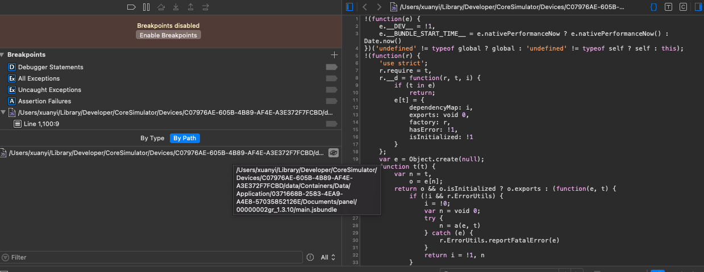

   我们发现， 加载完成后就是将指定文件目录读进了内存，那我们需要怎么样才能把这个文件读进内存呢？

   方案一、原生端读出来 js 文件，通过通知传递给 js 端， js 端通过 eval 来执行该代码。

   方案二、看原生端 RCTBridge 是如何加载 js 代码的，我们也通过这种方法加载。

   #### 把拆包后的代码加载到内存

   不用选择，肯定是方案二更靠谱一些。于是我们找到了这么两个方法。

   ```objective-c
   - (void)executeSourceCode:(NSData *)sourceCode sync:(BOOL)sync;
   - (void)executeSourceCode:(NSData *)sourceCode bundleUrl:(NSURL *)bundleUrl sync:(BOOL)sync;
   ```

   有什么区别呢？ 从参数可以看出一个没有设置 jsbundle 的路径，一个提供了参数设置该路径。我们选择多一个参数的方法来使用吧。

   于是我们使用刚才打包出的 js 包，通过这两个方法来加载。得到如下加载结果。

   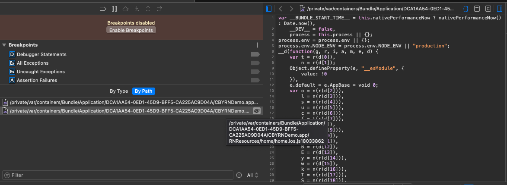

   我们成功把两个 RN 包加载到了内存里。

   #### 遇到的问题

   太顺利了，怎么可能这么顺利就完成了？

   其实这里面还有其他注意事项：

   1. 基础包要先加载完成

      基础包是业务包运行的基石，一定要保证基础包加载完成后才能去加载业务包， 不然会有很多异常。那怎么保证基础包加载完成了呢？

      - 上面提到过一个 js 代码加载完成的通知： RCTJavaScriptDidLoadNotification。

      - 通过判断 RCTBridge 的 isLoading 属性是否变为了 false。

        ```objective-c
         while (gRCTBridge.isLoading) {//侦听基础包是否加载完成 阻塞后续逻辑
              }
        ```

   2. 在 js 线程中执行代码

      代码的执行一定要在 js 线程中进行， 不然会有一些莫名其妙的崩溃问题。

      ```objective-c
      [gRCTBridge.batchedBridge dispatchBlock:^{
            [gRCTBridge.batchedBridge executeSourceCode:source.data bundleUrl:bundUrl sync:YES];
       } queue:RCTJSThread];
      ```

      先加载完 js 代码，再创建 RCTRootView,首先要保证 js 代码加载完成了，再去创建 RCTRootView，不然会抛出 require unknown module 的异常。

#### 拆包的好处

做了这么多，拆包到底有哪些优点值得我们去做呢？

1.  拆分业务逻辑，减少业务耦合度
2.  将业务拆分为多个实例加载，避免部分业务崩溃导致的整个 App 不可用
3.  减少热更新带来的资源浪费，将 RN 包拆分为基础包、公共包及业务包，不常有更新的基础包和公共包排除在业务包之外，降低了业务包的大小，能够极大降低更新时的带宽占用

### React Native 热更新及增量更新

#### 热更新

1.  什么是热更新

    有了拆包和加载的逻辑，热更新其实就是下载新的业务包，替换掉旧的业务包。

2.  如何保证热更新的版本可用

    但是如果热更新下来的业务包一直崩溃怎么办呢？

    - 方案一、 发布 bugfix 版本，修复热更新。前提：研发察觉到了线上崩溃。
    - 方案二、 线上设置回滚，退回到上个版本。
    - 方案三、 本地设置试运行机制，本地设置历史版本、试运行版本、正式版本三个版本目录，热更新版本首先添加到试运行版本中，首次运行成功后，再移动到正常版本目录，后续在正式版本目录中运行。若试运行连续崩溃到上限次数（如：2 次），则回滚上一版本（在历史版本目录下找到最后的可运行版本），并记录本次热更新失败，再次尝试热更新，若同样达到上限次数依然崩溃，那么放弃本次热更新版本，直到有下一个热更新版本发布。

3.  什么时机去更新

    热更新有很多方案，比如启动 App 时更新全部业务包、定时轮询更新全部业务包、推送更新业务包、启动业务时检查并更新当前业务包等

    - 启动 App 时更新全部业务包

      业务逻辑最为简单，在 App 启动后首先请求热更新接口查询 App 中已有的业务包是否有新版本，若有新版本，则下载新版本等待运行，若业务在 App 启动后尚未启动过，那么使用新版本启动业务包，若已启动过则下次启动时使用新版本业务包。

      优点： 启动后更新，业务逻辑处理简单，能保证多数场景下用户进入业务时使用的是最新版本的业务包。

      缺点： 增加 App 启动耗时，进入业务时可能热更新尚未完成，使用的仍然是旧版本业务包。对于一些不经常杀进程退出应用的用户不友好。

    - 定时轮询更新全部业务包

      对于热更新发布较频繁的应用，为保证业务版本更新率，定时轮询并下载热更新包也是一种较常见的方案。

      优点： 能最大程度上保证热更新的触达率。

      缺点： 对热更新接口考验较大，请求峰值可用性需要技术手段保证。定时请求存在较多的无效请求，浪费资源。

    - 推送更新业务包

      对于多数场景来说，推送是一个比较好的手段，只在有版本时进行更新，不存在无效请求又能保证版本更新的实时性。

      优点： 版本更新及时，不存在轮询方式带来的资源的浪费。

      缺点： 安卓推送的兼容性较差，不能保证用户一定开启应用推送。

    - 启动业务时更新当前业务包

      按需更新，只在用户启动业务时检测并下载新版本，更新完成后使用新版本进入业务。

      优点： 保证用户使用的一定是最新版本。

      缺点： 每次启动业务都要检查是否有新版本更新，存在资源浪费； 有新版本时，用户需要停在下载页面，下载完成后才能进入业务，用户体验较差。

    4. 增量更新

       热更新功能虽然已经能够满足我们使用的需求了，但依然存在着资源的浪费。每次业务更新都要下载一个全量的业务包，但业务包的变更可能只有一行代码。那我们怎么再次去降低成本呢。

       ​ 做过安卓开发的同学应该都知道，安卓有一项热修复的功能，就是打补丁包，将本次修改的内容与上次的进行对比，拆分出差异部分生成一个补丁包，旧版本的应用中下载到这个补丁包，将其合并到当前的版本中，就得到了新版本的 App，多数应用商店都采用一这种技术。

       ​ 我们 git 中也有 diff 方法，可以让我们查看两个文件的差异，其实增量更新和这 git diff 技术类似。就是遍历我们打出的业务包中的所有文件，找出有差异的文件，生成补丁包并压缩为对应版本的补丁包集合。 当我们 App 下载到补丁包后，将其与对应版本的业务包进行合并，合并完成后就得到了新版本的业务包。

       ​ 增量更新和全量更新的差异到底有多大呢？

       ​ 修改前的业务包内容：

       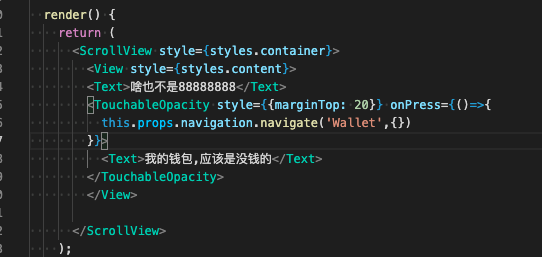

       修改后的业务包内容：

       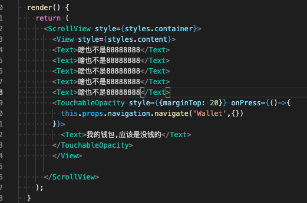

       修改后的全量包大小

       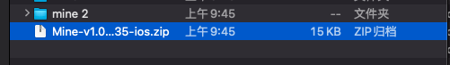

       修改后的增量包大小

       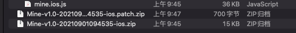

       如果不做拆包的全量包又有多大呢

       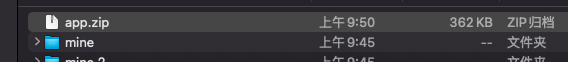

       这里的 demo 工程只有几个简单的页面，没有导入第三方依赖。想想如果导入了第三方依赖，再加上一些不经常变动的图片资源，那比例又会是怎样的呢。

       5. 如何加载新的 RN 包

          下载下来 RN 包，直接使用新的 RN 包加载业务就能生效了吗？其实并不然。

          我们都知道，我们在文件中通过 import 或 require 引入的依赖，最终都会被转换成 reqiure 的形式，而 require 是在 metro 中进行定义的。比如，我们在没有支持 hot reload 的 RN 框架下修改并保存了代码文件后，需要 reload 整个项目才会生效，这是因为 require 方法是有缓存策略的。

          我们打开 require.js 文件，会发现如下的逻辑。

          ```javascript
          const module = modules[moduleIdReallyIsNumber];
          return module && module.isInitialized
            ? module.publicModule.exports
            : guardedLoadModule(moduleIdReallyIsNumber, module);
          ```

          通过逻辑我们会发现，只有没有定义过对应 moduleId 的 module 时，require 才会去读取并加载对应的代码，如果定义过，就会走缓存中的数据。因此，我们热更新下来的业务包，如果之前启动过一次，再次进入也不会使用新业务包里的逻辑。那我们怎么办呢？

          通过上面的代码我们发现，模块代码会被缓存在 modules 变量中，那么我们退出业务时，把相关的 module 清理掉不就可以了？ 但什么时机去清理呢？

          这里我们就用到了一个熟悉又陌生的 Api， AppRegistry。 打开 AppRegistry 文档我们找到一个应用卸载的 api，unmountApplicationComponentAtRootTag， 这个 api 会在应用退出卸载时调用，我们只要在这个里面做一些清理操作就可以了。 但清理哪些东西呢， 是不是需要我们记录一下，总不能把所有的 modules 清空吧。我们再看到 runApplication 方法，这个方法便是 RCTRootView 调用 start 时调用的 js 方法，它是应用启动的起点。我们可以根据入口参数在保存应用中依赖到了模块及名称

          ```javascript
          const initRunApplication = AppRegistry.runApplication;
          const initUnmountApplicationComponentAtRootTag =
            AppRegistry.unmountApplicationComponentAtRootTag;
          AppRegistry.runApplication = (appKey, appParameters) => {
            const {
              rootTag,
              initialProps: { bundleName, bundleUrl, entry },
            } = appParameters;
            definedBizModules[rootTag] = {
              entry,
              prefix: `src/pages/${bundleName}/`,
            };
            new SourceTransformer(bundleUrl, bundleName);
            initRunApplication(appKey, appParameters);
          };
          AppRegistry.unmountApplicationComponentAtRootTag = rootTag => {
            initUnmountApplicationComponentAtRootTag(rootTag);
            const { entry, prefix } = definedBizModules[rootTag];
            console.log('unmount', entry);
            global.__destroyModules(entry, prefix);
          };
          ```

          为了保证应用正常运行，我们需要保留原方法，在我们的 hook 代码执行完成后，立即执行原方法。

          global.\_\_destroyModules 是怎么定义的呢，这我们就需要修改一些 require 里的代码了。

          ```javascript
          const destroyModules = function(dModule, prefix) {
            if (typeof dModule === 'string') {
              delete modules[dModule];
              Object.keys(modules).forEach((item, i) => {
                if (item.startsWith(prefix)) {
                  delete modules[item];
                }
              });
            }
          };
          global.__destroyModules = destroyModules;
          ```

          我们将指定路径下的 module 全部清理，下次再进入的时候就可以正常加载了。

### React Native 错误捕捉机制

#### 崩溃之后业务不可以用了？

大家都遇到过这么一种情况，业务出现崩溃之后在 debug 模式下会出现一个红屏，之后关闭红屏后，有时界面还可以操作，有时界面就变白屏了。这两种情况有什么差异呢？

​ 如果我们崩溃信息查看的仔细的话，应该可以看出这两种崩溃，一种是业务逻辑层的崩溃，比如：在点击某个按钮时，调用了某个空对象的属性值导致空指针问题，这时关闭红屏之后其他逻辑是不受影响的。 另一种是在 UI 层遇到这种空指针，导致界面渲染出现异常，这种情况整个界面就变成了白屏了，因此无法继续操作。

#### 逻辑层崩溃捕捉

如果看过 RN 的源码，我们会发现 RN 里这么几个文件来处理崩溃信息

​ ErrorUtils.js

​ ExceptionsManager.js

​ setUpErrorHandling.js

​ 其中在初始化 RN 核心框架时，会引用 setUpErrorHandling.js，在这个文件里会通过 ErrorUtils.setGlobalHandler 方法将 ExceptionsManager.handleException 设置为全局崩溃处理方法，ExceptionManager 又负责将这些异常信息传递给原生端。在 Debug 模式下，原生端会通过 RedBox 展示出崩溃的堆栈信息。在 Release 模式下，如果原生端不做处理，那么将会导致应用的崩溃。

​ 那么我们如何利用这个 ErrorUtils.setGlobalHandler 方法呢？

​ 由于 ErrorUtils 会被挂载到 global 下，因此我们可以直接通过 global.ErrorUtils 来调用其方法。

```javascript
const oldHandler = global.ErrorUtils.getGlobalHandler();
global.ErrorUtils.setGlobalHandler((error, isFatal) => {
  if (!__DEV__) {
    Alert.alert(
      '提示',
      `出错了：${error instanceof Object ? error.message : '未错误'}`,
      [
        {
          text: 'Cancel',
          onPress: () => console.log('Cancel Pressed'),
          style: 'cancel',
        },
        { text: 'OK', onPress: () => console.log('OK Pressed') },
      ],
      { cancelable: false },
    );
  } else {
    oldHandler(error, isFatal);
  }
});
```

这样，我们就拦截到了全局崩溃的信息。release 模式下出现异常只会弹窗提示，也不会出现崩溃了。

#### UI 层的崩溃捕捉

使用过 React 的同学应该都知道，React 提供了组件级崩溃捕捉方法 componentDidCatch， 这个方法在 RN 中同样适用，可以帮我们捕捉到 UI 层的崩溃。

```javascript
componentDidCatch(e, info) {
  this.parseError(e, true)
}
```

UI 层的崩溃一定时致命崩溃，出现该崩溃信息后，原界面就没有了操作的可能性。但我们可以将其拦截并通过界面渲染的方式提醒用户，并提供一个退出或重新加载的按钮供用户操作，避免界面中没有交互点的情况。

#### 崩溃信息的高级法

我们捕捉到崩溃信息之后肯定不能展示出来就完事了，我们需要根据崩溃信息定位问题并解决它。一般来说，如果我们对业务和代码足够熟悉，看到崩溃信息中提示的信息可能就知道哪里的代码逻辑出现了问题。但总有一些崩溃信息一眼看上去是没有头绪的，那我们怎么去理清头绪呢。

​ 还是刚才的 ExceptionsManager.js 文件，我们打开这个文件可以发现，在将崩溃信息传递给原生前，它做了一次堆栈的解析，使用到了 parseErrorStack 方法

```javascript
const parseErrorStack = require('./Devtools/parseErrorStack');
const stack = parseErrorStack(e);
```

这个方法可以解析出出错时的堆栈调用并将信息转换为一个 stack 数组。这样我们也可以拿到崩溃信息中的堆栈信息了。

### sourcemap 错误定位机制

对于压缩后的 js 代码，在出现崩溃时，很难第一时间定位出错误的代码行数。在没有其他辅助信息的情况下，我们可以根据崩溃信息堆栈中提示的代码行数，长到打包后代码对应的行数，进行上下文判断。

​ 我们还可以通过打包时输出 sourcemap，对代码堆栈进行还原，还原后我们将能得到更加详细的信息。

​ 什么是[sourcemap](https://github.com/mozilla/source-map)，可以参考阮一峰[ JavaScript Sourcemap 详解](https://www.ruanyifeng.com/blog/2013/01/javascript_source_map.html)。

​ 6.4 中我们提到我们可以通过 parseErrorStack 方法解析出调用堆栈数组，数组中包含调用信息所在的行列号，我们可以通过 source-map 库来对代码堆栈进行原始文件行列号进行还原。 这里还要依赖到打包环节打出的 sourcemap 包(--sourcemap-output 后为保存路径)。

```javascript
var sourceMap = require('source-map');
var fs = require('fs');
fs.readFile('path_to_sourcemap_file', 'utf8', function(err, data) {
  var smc = new sourceMap.SourceMapConsumer(data);
  console.log(
    smc.originalPositionFor({
      line: 298,
      column: 963,
    }),
  );
});
```

这样我们就可以知道，错误出现在哪个代码行了。

### AppRegistry

​ 对于 AppRegistry 这个 Api，大家可能会比较陌生，但它的功能确十分强大。

​ 我们在业务中接触它一般是在入口文件中，仅此一行。

```javascript
AppRegistry.registerComponent('Home', () => App, false);
```

但我们打开 AppRegistry 的文件或[AppRegistry 文档](https://reactnative.cn/docs/appregistry)，我们会发现，这里面有很多实用的功能。

- runApplication:热更新章节提到过，这是启动入口，我们可以在这里 hook 一些代码，做一些预处理的工作。

- unmountApplicationComponentAtRootTag:热更新章节提到过，这是退出时执行的操作，我们可以在这里做一些清理工作。

- setWrapperComponentProvider:如果我们使用过 react-native-root-siblings，就会发现里面有一个方法使用到这个 Api，它是一个高阶 API， 可以使用它给我们的根组件添加功能。

  ```javascript
  function RootSiblingsWrapper(props) {
    return (
      <View style={styles.container} pointerEvents="box-none">
        {props.children}
        <RootSiblings />
      </View>
    );
  }
  if (!global.__rootSiblingsInjected) {
    AppRegistry.setWrapperComponentProvider(function() {
      return RootSiblingsWrapper;
    });
    global.__rootSiblingsInjected = true;
  }
  ```

- startHeadlessTask、registerHeadlessTask、registerCancellableHeadlessTask、cancelHeadlessTask 这几个方法比较有意思，我们都知道，我们的业务代码是需要在有界面的情况下执行的，要执行业务逻辑，首先要启动一个界面，在界面启动的某个时机去执行代码。HeadlessTask 解除了对 UI 层的依赖，这就相当于，它可以在后台自动持续地运行。比如我可以要某个页面启动一个 HeadlessTask，退出这个界面，这个任务可以持续运行，直到任务执行完成自己结束，或通过 cancelHeadlessTask 方法将任务结束。

  这个功能就可以让我们去实现一些需要后台运行的逻辑，比如：数据同步、下载任务等。

### 涂鸦智能 RN 面板加载逻辑

#### 面板 RN 包载入逻辑

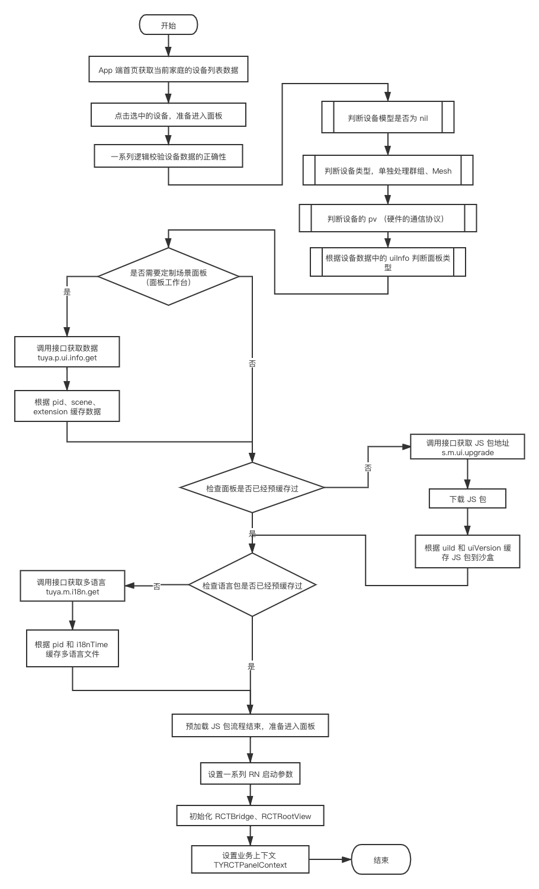
